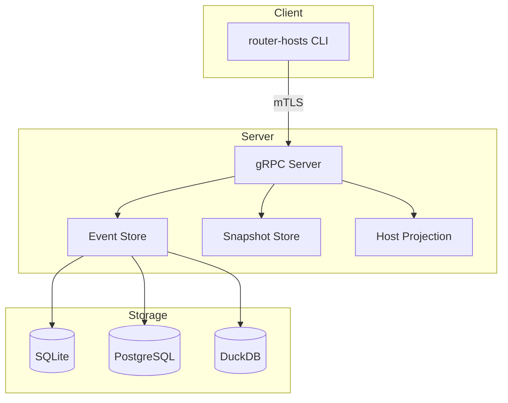

# Architecture Overview

This document describes the architecture of router-hosts, a Rust CLI tool for managing DNS host entries on routers and servers.

## System Overview

router-hosts uses a client-server architecture:

- **Server** runs on the target machine (router, server, container), manages a configurable hosts file via event-sourced storage
- **Client** runs on workstation, connects via gRPC over TLS with mutual authentication



See `docs/plans/2025-12-01-router-hosts-v1-design.md` for complete design specification.

## Workspace Structure

Six crates in a Cargo workspace:

### router-hosts-common

Shared library containing:
- Protocol buffer definitions and generated code
- Validation logic (IP addresses, hostnames)
- Shared types and utilities

### router-hosts-storage

Storage abstraction layer:
- `Storage` trait defining EventStore, SnapshotStore, and HostProjection
- SQLite backend (default, lightweight, embedded, single-file)
- PostgreSQL backend (multi-instance, cloud deployments, connection pooling)
- DuckDB backend (embedded, feature-rich analytics) - requires separate binary
- Shared test suite for backend compliance (42 tests)

### router-hosts

Main binary (client and server modes):
- **Client mode (default):** CLI interface using clap, gRPC client wrapper, command handlers
- **Server mode:** gRPC service implementation, storage integration, hosts file generation with atomic writes, post-edit hook execution, Prometheus metrics
- Mode selection: runs in server mode when first argument is "server", otherwise client mode
- Includes SQLite and PostgreSQL backends

### router-hosts-duckdb

Variant binary with DuckDB support:
- Same functionality as router-hosts
- Includes all three storage backends (SQLite, PostgreSQL, DuckDB)
- Larger binary size due to DuckDB dependencies

### router-hosts-operator

Kubernetes operator for automated DNS registration:
- Watches Traefik IngressRoute, IngressRouteTCP, and custom HostMapping CRDs
- Automatically registers/updates host entries with router-hosts server
- Leader election for high availability
- Health endpoints for Kubernetes probes
- See [Operator Documentation](../guides/kubernetes.md) for details

### router-hosts-e2e

End-to-end acceptance tests:
- Docker-based integration tests with real mTLS
- 10 tests across 4 scenario files covering CRUD, auth, disaster recovery

## Key Design Decisions

### Event Sourcing

The server uses **CQRS (Command Query Responsibility Segregation)** with **Event Sourcing**:

- All changes stored as immutable events in the storage backend
- Current state reconstructed from event log
- Complete audit trail and time-travel query capability
- Optimistic concurrency via event versions

**Why event sourcing?** Traditional soft-delete CRUD patterns complicated queries and limited audit capabilities. Event sourcing provides:

- Immutable event log as single source of truth
- Complete history - every change recorded as an event
- Time travel - reconstruct state at any point in time
- No soft deletes - deletion is just another event (`HostDeleted`)

**Domain events:**

| Event | Description |
|-------|-------------|
| `HostCreated` | New host entry created |
| `IpAddressChanged` | IP address modified |
| `HostnameChanged` | Hostname modified |
| `CommentUpdated` | Comment added/changed |
| `TagsModified` | Tags updated |
| `AliasesModified` | Aliases updated |
| `HostDeleted` | Tombstone event |

**Optimistic concurrency:** Each event has a version number. Updates must specify the expected version; if another write occurred, the operation fails with `ABORTED` (version mismatch), and the client must retry.

**Projections:** Materialized views built from events for efficient queries. The `host_entries_current` view shows active hosts by replaying events and filtering out deleted entries.

### Streaming APIs

- All multi-item operations use gRPC streaming (not arrays/lists)
- `ListHosts`, `SearchHosts`, `ExportHosts` - server streaming
- `ImportHosts` - bidirectional streaming
- Better memory efficiency and flow control

### Request/Response Messages

- All gRPC methods use dedicated request/response types
- Never bare parameters - enables API evolution without breaking changes

### Atomic /etc/hosts Updates

- Generate to `.tmp` file -> fsync -> atomic rename
- Original file unchanged on failure
- Post-edit hooks run after success/failure

### Versioning

- Storage backend stores snapshots of /etc/hosts at points in time
- Configurable retention (max count and max age)
- Rollback creates snapshot before restoring old version

## Security

- TLS with mutual authentication (client certs) is mandatory
- No fallback to insecure connections
- Server validates client certificates against configured CA

## Observability

### Prometheus Metrics

The server exposes Prometheus metrics on a configurable HTTP endpoint:

- **Request metrics**: `router_hosts_requests_total`, `router_hosts_request_duration_seconds`
- **Storage metrics**: `router_hosts_storage_operations_total`, `router_hosts_storage_duration_seconds`
- **Host metrics**: `router_hosts_hosts_entries`
- **Hook metrics**: `router_hosts_hook_executions_total`, `router_hosts_hook_duration_seconds`

See [Operations Guide](../guides/operations.md#prometheus-metrics) for configuration.

### Health Endpoints

- **Server**: `Liveness`, `Readiness`, and `Health` RPCs within `HostsService` for monitoring probes
- **Operator**: HTTP endpoints at `/healthz` (liveness) and `/readyz` (readiness)

## Configuration

### Server Configuration

Server requires:
- `hosts_file_path` setting (no default) - prevents accidental overwrites
- TLS certificate paths
- Storage backend: SQLite (default), PostgreSQL URL, or DuckDB path
- Optional: retention policy, hooks, metrics endpoint, timeout settings

### Client Configuration

- Config file optional (CLI args override)
- Server address and TLS cert paths

## Storage Layer

- **Storage trait** in `router-hosts-storage` abstracts database operations
- **Available backends:**
  - **SQLite** (default): Lightweight embedded, single file, wide compatibility
  - **PostgreSQL**: Multi-instance deployments, connection pooling, cloud-ready
  - **DuckDB**: Embedded, single file, feature-rich analytics (requires `router-hosts-duckdb` binary)
- Default path: `~/.local/share/router-hosts/hosts.db` (XDG-compliant)
- Use in-memory mode for tests: `SqliteStorage::new(":memory:")`
- Shared test suite validates any `Storage` implementation (42 tests)

## Validation

All validation logic lives in `router-hosts-common/src/validation.rs`:
- IPv4/IPv6 address validation
- Hostname validation (DNS compliance)
- Duplicate detection happens at database level

## Error Handling

Map domain errors to appropriate gRPC status codes:
- `INVALID_ARGUMENT` - validation failures
- `ALREADY_EXISTS` - duplicates
- `NOT_FOUND` - missing entries/snapshots
- `ABORTED` - concurrent write conflicts (version mismatch)
- `PERMISSION_DENIED` - TLS auth failures

Include detailed error context in response messages.

## Testing Strategy

- **Unit tests:** Mock filesystem for /etc/hosts operations
- **Integration tests:** Use in-memory DuckDB, self-signed certs
- **Storage tests:** Shared test suite in `router-hosts-storage/tests/common/` (42 tests)
  - Any new storage backend must pass all tests via `run_all_tests(&storage).await`
- **E2E tests:** Docker containers with real mTLS (10 tests across 4 scenarios)
- **No real file system writes** in tests (use tempfiles or mocks)

## /etc/hosts Format

Generated file includes:
- Header comment with metadata (timestamp, entry count)
- Sorted entries (by IP, then hostname)
- Hostname aliases (sorted alphabetically after canonical hostname)
- Inline comments from entry metadata
- Tags shown as `[tag1, tag2]` in comments

Example:
```
# Generated by router-hosts
# Last updated: 2025-11-28 20:45:32 UTC
# Entry count: 42

192.168.1.10    server.local srv web    # Main server [prod]
192.168.1.20    nas.home.local    # NAS storage [homelab]
```

## Hostname Aliases

Full support for hostname aliases per hosts(5) format.

### CLI Usage

```bash
# Add host with aliases (--alias is repeatable)
router-hosts host add --ip 192.168.1.10 --hostname server.local \
  --alias srv --alias web

# Update aliases (replaces all)
router-hosts host update <id> --alias primary --alias backup

# Clear all aliases
router-hosts host update <id> --clear-aliases

# Import with alias conflict override
router-hosts host import hosts.txt --conflict-mode strict --force
```

### Key Behaviors

- Aliases are sorted alphabetically in all output for deterministic results
- Search matches both canonical hostname and aliases (case-insensitive)
- Validation prevents alias matching canonical hostname or duplicates
- CSV format: aliases are semicolon-separated (e.g., `srv;web;api`)

### API Notes

- `UpdateHostRequest` uses `AliasesUpdate` wrapper message for aliases
- `None` = preserve existing, `Some(vec![])` = clear, `Some(values)` = replace
- Same pattern used for tags via `TagsUpdate` wrapper

## Rust Best Practices

### Error Handling

- Use `Result<T, E>` for fallible operations (never `panic!` in library code)
- Use `thiserror` for custom error types with good error messages
- Use `anyhow` for application-level error handling
- Propagate errors with `?` operator, not `.unwrap()` or `.expect()`
- Only use `.expect()` in tests or when invariant is guaranteed by type system

### Type Safety

- Use newtypes for domain concepts: `struct HostId(String)` not bare `String`
- Use builder pattern for complex constructors
- Leverage Rust's type system to make invalid states unrepresentable
- Use `#[non_exhaustive]` for public enums that might grow

### Async Patterns

- Prefer `tokio::spawn` for CPU-bound work in separate tasks
- Use `tokio::select!` carefully (ensure all branches are cancel-safe)
- Avoid holding locks across `.await` points
- Use `#[tokio::test]` for async tests

### Performance

- Use `&str` for read-only string data, `String` for owned
- Prefer `&[T]` over `&Vec<T>` in function parameters
- Use `Cow<'_, str>` when you might need to own or borrow
- Avoid unnecessary clones - use references when possible
- Use `Arc<T>` for shared ownership across threads

### Memory Safety

- Minimize `unsafe` code (justify each use with SAFETY comment)
- Use `#[must_use]` for types/functions where ignoring return is likely a bug
- Prefer stack allocation over heap when possible

### Code Organization

- Keep functions small (< 50 lines)
- Maximum cyclomatic complexity of 10 per function
- Use modules to organize related functionality
- Public APIs should be minimal and well-documented

### Documentation

- All public items must have doc comments (`///`)
- Include examples in doc comments for non-trivial APIs
- Use `//!` module-level docs to explain module purpose
- Document panics, errors, and safety requirements

### Modern Rust Features (Edition 2021+)

**Use these patterns:**
- `if let` chains: `if let Some(x) = opt && x > 5 { }`
- `let else`: `let Some(x) = opt else { return }`
- `impl Trait` in function signatures for clarity
- `async fn` in traits (requires `async-trait` or nightly)
- Const generics where applicable

**Avoid:**
- `.clone()` on `Arc<T>` without understanding ref counting
- `Rc<RefCell<T>>` in async code (not `Send`)
- String allocations in hot paths
- Excessive trait bounds (use `where` clauses for readability)

## Dependencies

Core dependencies (see Cargo.toml for versions):
- `tonic` + `prost` - gRPC/protobuf
- `tonic-build` + `protobuf-src` - protobuf code generation with bundled protoc
- `duckdb` - embedded database
- `tokio` - async runtime
- `clap` - CLI parsing
- `serde` + `toml` - config
- `rustls` - TLS
- `tracing` - logging
- `proptest` - property-based testing

**Note on Protocol Buffers:** The project uses `protobuf-src` to provide a bundled
Protocol Buffers compiler (`protoc`), eliminating the need for system installation.
This makes the build self-contained and portable across development environments.

### Dependency Management

**Philosophy:**
- Minimize dependencies (each dependency is a liability)
- Prefer well-maintained crates with recent updates
- Check `cargo-audit` regularly for security issues
- Pin versions in `Cargo.lock` (committed for binaries)

**Workspace Dependencies:**
- All dependency versions defined in workspace `Cargo.toml`
- Individual crates use `workspace = true` references
- Keep dependencies up-to-date (check monthly)

**Security:**
```bash
# Install audit tool
cargo install cargo-audit

# Check for vulnerabilities
cargo audit

# Check for outdated dependencies
cargo outdated --workspace
```
