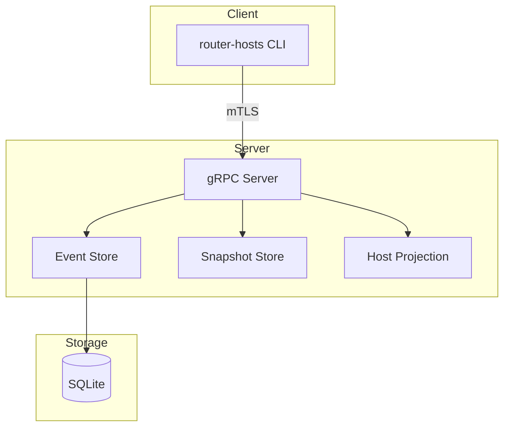

# Architecture Overview

This document describes the architecture of router-hosts, a Go CLI tool for managing DNS host entries on routers and servers.

## System Overview

router-hosts uses a client-server architecture:

- **Server** runs on the target machine (router, server, container), manages a configurable hosts file via event-sourced storage
- **Client** runs on workstation, connects via gRPC over TLS with mutual authentication


```mermaid
flowchart TB
    subgraph Client
        CLI[router-hosts CLI]
    end

    subgraph Server
        GRPC[gRPC Server]
        ES[Event Store]
        SNAP[Snapshot Store]
        PROJ[Host Projection]
    end

    subgraph Storage
        SQLite[(SQLite)]
    end

    CLI -->|mTLS| GRPC
    GRPC --> ES
    GRPC --> SNAP
    GRPC --> PROJ
    ES --> SQLite
```

See `docs/plans/2025-12-01-router-hosts-v1-design.md` for complete design specification.

## Package Structure

Go module with the following packages:

### `internal/domain`

Domain types, events, host aggregate, and error codes.

### `internal/validation`

IP address, hostname, and alias validation logic.

### `internal/storage`

Storage interfaces: `EventStore`, `SnapshotStore`, `HostProjection`.

### `internal/storage/sqlite`

SQLite implementation using `modernc.org/sqlite` (pure Go, no CGO).

### `internal/config`

Server and client TOML configuration parsing.

### `internal/server`

gRPC server, command handler, hosts file generation, write queue, post-edit hooks, and OpenTelemetry instrumentation.

### `internal/client`

gRPC client wrapper with mTLS support.

### `internal/client/commands`

Cobra CLI commands for all client operations.

### `internal/client/output`

Output formatters: table, JSON, CSV.

### `internal/client/tui`

Bubble Tea interactive terminal UI components.

### `internal/acme`

ACME certificate management using lego (DNS-01/Cloudflare).

### `internal/operator`

Kubernetes operator controllers for HostMapping CRD and IngressRoute watching.

### `cmd/router-hosts`

Main binary entry point. Client mode by default; server mode via `serve` subcommand.

### `cmd/operator`

Kubernetes operator binary entry point.

### `e2e/`

End-to-end acceptance tests:

- In-process tests with real mTLS via `crypto/x509` and `bufconn`
- 10 tests covering CRUD, import/export, aliases, search, auth rejection, snapshots, rollback

## Key Design Decisions

### Event Sourcing

The server uses **CQRS (Command Query Responsibility Segregation)** with **Event Sourcing**:

- All changes stored as immutable events in the storage backend
- Current state reconstructed from event log
- Complete audit trail and time-travel query capability
- Optimistic concurrency via event versions

**Why event sourcing?** Traditional soft-delete CRUD patterns complicated queries and limited audit capabilities. Event sourcing provides:

- Immutable event log as single source of truth
- Complete history - every change recorded as an event
- Time travel - reconstruct state at any point in time
- No soft deletes - deletion is just another event (`HostDeleted`)

**Domain events:**

| Event | Description |
|-------|-------------|
| `HostCreated` | New host entry created |
| `IpAddressChanged` | IP address modified |
| `HostnameChanged` | Hostname modified |
| `CommentUpdated` | Comment added/changed |
| `TagsModified` | Tags updated |
| `AliasesModified` | Aliases updated |
| `HostDeleted` | Tombstone event |

**Optimistic concurrency:** Each event has a version number. Updates must specify the expected version; if another write occurred, the operation fails with `ABORTED` (version mismatch), and the client must retry.

**Projections:** Materialized views built from events for efficient queries. The `host_entries_current` view shows active hosts by replaying events and filtering out deleted entries.

### Streaming APIs

- All multi-item operations use gRPC streaming (not arrays/lists)
- `ListHosts`, `SearchHosts`, `ExportHosts` - server streaming
- `ImportHosts` - bidirectional streaming
- Better memory efficiency and flow control

### Request/Response Messages

- All gRPC methods use dedicated request/response types
- Never bare parameters - enables API evolution without breaking changes

### Atomic /etc/hosts Updates

- Generate to `.tmp` file -> fsync -> atomic rename
- Original file unchanged on failure
- Post-edit hooks run after success/failure

### Versioning

- Storage backend stores snapshots of /etc/hosts at points in time
- Configurable retention (max count and max age)
- Rollback creates snapshot before restoring old version

## Security

- TLS with mutual authentication (client certs) is mandatory
- No fallback to insecure connections
- Server validates client certificates against configured CA

## Observability

### Metrics and Tracing (OpenTelemetry)

All metrics and traces are exported via OpenTelemetry (OTLP/gRPC) to a collector:

- **Request metrics**: `router_hosts_requests_total`, `router_hosts_request_duration_seconds`
- **Storage metrics**: `router_hosts_storage_operations_total`, `router_hosts_storage_duration_seconds`
- **Host metrics**: `router_hosts_hosts_entries`
- **Hook metrics**: `router_hosts_hook_executions_total`, `router_hosts_hook_duration_seconds`

See [Operations Guide](../guides/operations.md#metrics-and-tracing-opentelemetry) for configuration.

### Health Endpoints

- **Server**: `Liveness`, `Readiness`, and `Health` RPCs within `HostsService` for monitoring probes
- **Operator**: HTTP endpoints at `/healthz` (liveness) and `/readyz` (readiness)

## Configuration

### Server Configuration

Server requires:

- `hosts_file_path` setting (no default) - prevents accidental overwrites
- TLS certificate paths
- Storage backend: SQLite (default)
- Optional: retention policy, hooks, metrics endpoint, timeout settings

### Client Configuration

- Config file optional (CLI args override)
- Server address and TLS cert paths

## Storage Layer

- **Storage interfaces** in `internal/storage` abstract database operations
- **Available backend:**
  - **SQLite** (default): Lightweight embedded, single file, pure Go via `modernc.org/sqlite`
- Default path: `~/.local/share/router-hosts/hosts.db` (XDG-compliant)
- Use in-memory mode for tests: `sqlite.New(":memory:")`

## Validation

All validation logic lives in `internal/validation/`:

- IPv4/IPv6 address validation
- Hostname validation (DNS compliance)
- Duplicate detection happens at database level

## Error Handling

Map domain errors to appropriate gRPC status codes:

- `INVALID_ARGUMENT` - validation failures
- `ALREADY_EXISTS` - duplicates
- `NOT_FOUND` - missing entries/snapshots
- `ABORTED` - concurrent write conflicts (version mismatch)
- `PERMISSION_DENIED` - TLS auth failures

Include detailed error context in response messages.

## Testing Strategy

- **Unit tests:** Use `t.TempDir()` for filesystem operations
- **Integration tests:** Use in-memory SQLite (`:memory:`), self-signed certs
- **E2E tests:** In-process with real mTLS via `crypto/x509` and `bufconn` (10 tests)
- **Property-based tests:** Use `pgregory.net/rapid` for validation logic

## /etc/hosts Format

Generated file includes:

- Header comment with metadata (timestamp, entry count)
- Sorted entries (by IP, then hostname)
- Hostname aliases (sorted alphabetically after canonical hostname)
- Inline comments from entry metadata
- Tags shown as `[tag1, tag2]` in comments

Example:

```text
# Generated by router-hosts
# Last updated: 2025-11-28 20:45:32 UTC
# Entry count: 42

192.168.1.10    server.local srv web    # Main server [prod]
192.168.1.20    nas.home.local    # NAS storage [homelab]
```

## Hostname Aliases

Full support for hostname aliases per hosts(5) format.

### CLI Usage

```bash
# Add host with aliases (--alias is repeatable)
router-hosts host add --ip 192.168.1.10 --hostname server.local \
  --alias srv --alias web

# Update aliases (replaces all)
router-hosts host update <id> --alias primary --alias backup

# Clear all aliases
router-hosts host update <id> --clear-aliases

# Import with alias conflict override
router-hosts host import hosts.txt --conflict-mode strict --force
```

### Key Behaviors

- Aliases are sorted alphabetically in all output for deterministic results
- Search matches both canonical hostname and aliases (case-insensitive)
- Validation prevents alias matching canonical hostname or duplicates
- CSV format: aliases are semicolon-separated (e.g., `srv;web;api`)

### API Notes

- `UpdateHostRequest` uses `AliasesUpdate` wrapper message for aliases
- Unset = preserve existing, empty list = clear, populated list = replace
- Same pattern used for tags via `TagsUpdate` wrapper

## Go Best Practices

### Error Handling

- Use `samber/oops` for domain errors with structured error codes
- Return `error` interface from all fallible operations
- Wrap errors with context: `oops.Wrapf(err, "loading config")`
- Never ignore errors silently; handle or propagate them
- Use sentinel errors or error codes for domain-specific failures

### Type Safety

- Use strong types for domain concepts (e.g., `type HostID string`), avoid bare strings for IDs
- Use functional options or builder patterns for complex constructors
- Leverage interfaces to define contracts between packages

### Concurrency

- Use goroutines and channels for concurrent operations
- Use `context.Context` for cancellation and deadline propagation
- Protect shared state with `sync.Mutex` or prefer channel-based communication
- Use `sync.WaitGroup` for coordinating goroutine completion
- Use `errgroup` for concurrent operations that may fail

### Testing

- Write table-driven tests for comprehensive coverage
- Use `testify` for assertions and test suites
- Use `bufconn` for in-process gRPC testing (no network required)
- Use `t.TempDir()` for filesystem operations in tests
- Use `pgregory.net/rapid` for property-based testing

### Code Organization

- Keep functions small (< 50 lines)
- Use `internal/` packages for unexported implementation details
- Public APIs should be minimal and well-documented
- Follow standard Go project layout conventions

## Dependencies

Core dependencies (see `go.mod` for versions):

- `google.golang.org/grpc` + `google.golang.org/protobuf` - gRPC/protobuf
- `github.com/spf13/cobra` - CLI parsing
- `github.com/BurntSushi/toml` - configuration
- `github.com/samber/oops` - structured error handling
- `github.com/charmbracelet/bubbletea` - terminal UI
- `github.com/go-acme/lego/v4` - ACME certificate management
- `modernc.org/sqlite` - SQLite (pure Go, no CGO)
- `go.opentelemetry.io/otel` - OpenTelemetry instrumentation
- `sigs.k8s.io/controller-runtime` - Kubernetes operator framework
- `pgregory.net/rapid` - property-based testing
- `github.com/stretchr/testify` - test assertions

Dependencies are managed via Go modules (`go.mod` / `go.sum`).
