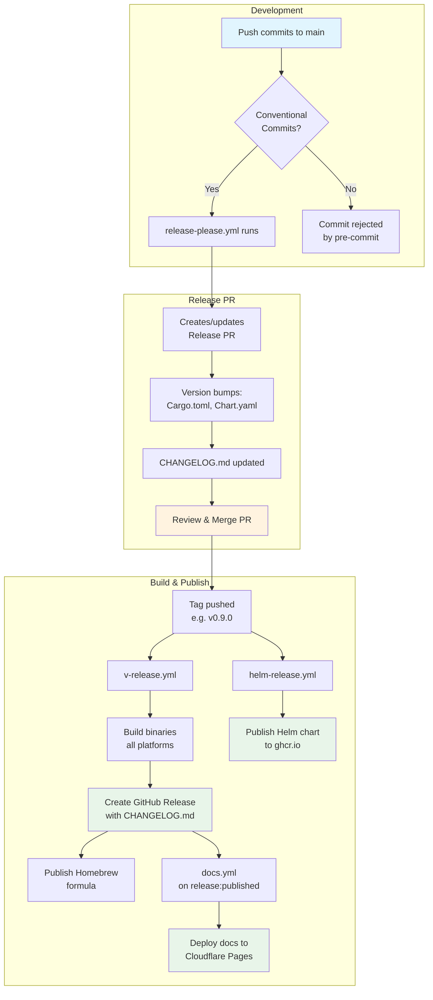

# Release Process

This document describes the automated release process for router-hosts using [release-please](https://github.com/googleapis/release-please).

## Overview

Releases are fully automated:

1. **Push commits to `main`** using [Conventional Commits](https://www.conventionalcommits.org/) format
2. **release-please creates a Release PR** with version bumps and changelog updates
3. **Merge the Release PR** to trigger the release
4. **Workflows build and publish** binaries, Helm chart, and documentation



## Conventional Commits

All commits to `main` **must** use Conventional Commits format. This enables:

- Automatic version determination (major/minor/patch)
- Automatic changelog generation
- Pre-commit validation via cocogitto

### Commit Format

```
<type>(<scope>): <subject>

<body>

<footer>
```

### Version Bump Rules

| Commit Type | Version Bump | Example |
|-------------|--------------|---------|
| `feat!:` or `BREAKING CHANGE:` | Major (0.x → 1.0) | API breaking change |
| `feat:` | Minor (0.8.0 → 0.9.0) | New feature |
| `fix:`, `perf:` | Patch (0.8.0 → 0.8.1) | Bug fix, performance |
| `docs:`, `refactor:`, `test:`, `ci:`, `chore:` | No bump | Internal changes |

### Pre-commit Validation

Commit messages are validated automatically:

```bash
# Install pre-commit hooks (including commit-msg validation)
pre-commit install
pre-commit install --hook-type commit-msg
pre-commit install --hook-type pre-push
```

If your commit message doesn't follow the format, the commit will be rejected with guidance.

### Prerequisites

The commit message validation requires cocogitto:

```bash
# Install cocogitto (macOS)
brew install cocogitto

# Or via cargo (cross-platform)
cargo install cocogitto
```

## Creating a Release

### Standard Release Flow

1. **Push conventional commits to `main`**
   ```bash
   git commit -m "feat(server): add metrics endpoint"
   git push origin main
   ```

2. **Wait for Release PR**
   - `release-please.yml` workflow runs automatically
   - Creates/updates PR titled "chore(main): release router-hosts X.Y.Z"
   - PR contains version bumps and changelog updates

3. **Review the Release PR**
   - Verify changelog entries are accurate
   - Confirm version bump is correct (major/minor/patch)
   - Check that Helm chart version is synced

4. **Merge the Release PR**
   - Merging pushes the version tag (e.g., `v0.9.0`)
   - Tag push triggers downstream workflows

5. **Automated workflows trigger on tag**
   - `v-release.yml`: Builds binaries, creates GitHub Release (uses CHANGELOG.md)
   - `helm-release.yml`: Publishes Helm chart to ghcr.io
   - `docs.yml`: Deploys documentation to Cloudflare Pages

### Version Files

release-please automatically updates these files:

| File | Fields Updated |
|------|----------------|
| `Cargo.toml` (workspace) | `version` |
| `charts/router-hosts-operator/Chart.yaml` | `version`, `appVersion` |
| `CHANGELOG.md` | New release section |

## Testing Releases Locally

Before pushing, test the release build process:

```bash
# Test release build locally (without publishing)
dist build --artifacts=local --output-format=json

# Dry-run for a specific tag (shows what would be created)
dist plan --tag=v0.9.0

# Check what artifacts would be generated
dist plan --tag=v0.9.0 --output-format=json | jq '.artifacts'

# Test that binaries are stripped (for smaller size)
cargo build --profile=dist -p router-hosts
ls -lh target/dist/router-hosts
file target/dist/router-hosts  # Should show "stripped"

# Verify the binary runs correctly
./target/dist/router-hosts --version
./target/dist/router-hosts --help
```

## Required GitHub Secrets

The following secrets must be configured in the repository:

### Release Secrets

- **`RELEASE_PLEASE_APP_ID`**: GitHub App ID for release-please authentication
  - The GitHub App must have `contents: write` and `pull-requests: write` permissions
  - Using a GitHub App allows the release PR merge to trigger downstream workflows

- **`RELEASE_PLEASE_PRIVATE_KEY`**: GitHub App private key (PEM format)
  - Generate in the GitHub App settings

- **`HOMEBREW_TAP_TOKEN`**: Personal access token with `contents: write` permission for `fzymgc-house/homebrew-tap`
  - Create at: https://github.com/settings/tokens/new
  - Required scopes: `public_repo` (or `repo` if tap is private)
  - Add at: https://github.com/fzymgc-house/router-hosts/settings/secrets/actions

### Documentation Deployment Secrets

For automated documentation deployment to Cloudflare Pages:

- **`CLOUDFLARE_ACCOUNT_ID`**: Cloudflare account identifier
  - Find at: Cloudflare Dashboard → Account Home → right sidebar
- **`CLOUDFLARE_PAGES_ACCOUNT_API`**: API token with Pages deployment permission
  - Create at: Cloudflare Dashboard → My Profile → API Tokens → Create Token
  - Use template: "Edit Cloudflare Pages"
  - Or custom token with: `Zone:Read`, `Account:Cloudflare Pages:Edit`

## Documentation Setup

Create a Cloudflare Pages project before the first release:

1. Go to Cloudflare Dashboard → Workers & Pages → Create
2. Select "Pages" → "Direct Upload" (not Git connection)
3. Name the project: `router-hosts-docs`
4. The docs workflow will deploy using Wrangler

## Post-Release Verification

After the release workflow completes, use the automated verification script:

```bash
# Automated verification (downloads, verifies attestations, checks audit data)
./scripts/verify-release.sh v0.9.0
```

Or manually verify each step:

```bash
# 1. Verify GitHub Release was created
gh release view v0.9.0

# 2. Test shell installer (in clean environment/container)
curl --proto '=https' --tlsv1.2 -LsSf \
  https://github.com/fzymgc-house/router-hosts/releases/download/v0.9.0/router-hosts-installer.sh | sh

# 3. Verify binary attestations
gh attestation verify router-hosts --repo fzymgc-house/router-hosts

# 4. Test Homebrew tap installation (preferred method)
brew install fzymgc-house/tap/router-hosts

# Alternative: Direct formula install from release
curl -LO https://github.com/fzymgc-house/router-hosts/releases/download/v0.9.0/router-hosts.rb
brew install --formula ./router-hosts.rb

# 5. Check embedded audit data (requires cargo-auditable)
cargo auditable info router-hosts

# 6. Verify Helm chart
helm pull oci://ghcr.io/fzymgc-house/charts/router-hosts-operator --version 0.9.0
```

## Release Tag Format

release-please uses semantic versioning with `v` prefix:

- `v0.9.0` - Standard release
- `v0.9.1-rc.1` - Pre-release (marked as prerelease in GitHub)

## Workflow Configuration

### release-please.yml

Creates/updates release PRs and pushes tags when merged. Configuration in `release-please-config.json`.

Key settings:
- `skip-github-release: false` - release-please creates GitHub Release and pushes tag, cargo-dist then adds binaries
- `extra-files` - Syncs Cargo.toml workspace version and Chart.yaml version/appVersion

### v-release.yml

Builds binaries using cargo-dist. Named `v-release.yml` because cargo-dist uses this convention when `tag-namespace = "v"` is configured.

Key settings in `dist-workspace.toml`:
- `changelog = false` - Don't generate changelog (release-please manages it)
- `github-release = "CHANGELOG.md"` - Use release-please's changelog for release notes

**Warning:** Do not rename `v-release.yml` manually. Running `dist generate-ci` will recreate it with the original name.

### helm-release.yml

Publishes Helm chart to GitHub Container Registry (ghcr.io) as an OCI artifact.

**Requirements:**
- Helm 4.x (CI uses v4.0.4)
- Chart version must match the release tag

For manual chart publishing (if workflow failed):

```bash
gh workflow run helm-release.yml -f tag=v0.9.0
```

## Release Artifacts

Each release includes:

| Artifact | Description |
|----------|-------------|
| `router-hosts-x86_64-unknown-linux-gnu.tar.xz` | Linux x86_64 binary |
| `router-hosts-aarch64-unknown-linux-gnu.tar.xz` | Linux ARM64 binary |
| `router-hosts-x86_64-apple-darwin.tar.xz` | macOS Intel binary |
| `router-hosts-aarch64-apple-darwin.tar.xz` | macOS Apple Silicon binary |
| `router-hosts-installer.sh` | Universal shell installer |
| `router-hosts.rb` | Homebrew formula |
| `router-hosts-operator` Helm chart | Published to `oci://ghcr.io/fzymgc-house/charts` |

## Rollback

If a release has issues:

1. **Don't delete the release** - users may have already downloaded it
2. Create a new patch release with the fix (e.g., v0.9.1)
3. Add a note to the problematic release warning users
4. If critical security issue:
   - Create hotfix immediately
   - Consider yanking the vulnerable release (rare)

## Troubleshooting

### Release PR not created

1. Check that commits use Conventional Commits format
2. Verify `release-please.yml` workflow ran successfully
3. Look for existing release PR that needs updating
4. Check GitHub App permissions (needs `contents: write` and `pull-requests: write`)

### Version not bumping

- Commits like `docs:`, `chore:`, `ci:` don't trigger version bumps
- Use `feat:` for new features, `fix:` for bug fixes

### Helm chart version mismatch

release-please automatically syncs Chart.yaml via `extra-files` in `release-please-config.json`. If mismatch occurs:

1. Check `release-please-config.json` extra-files configuration
2. Manually update Chart.yaml and re-push

### GitHub App token issues

If the release PR doesn't trigger downstream workflows:

1. Verify GitHub App has correct permissions
2. Check that secrets `RELEASE_PLEASE_APP_ID` and `RELEASE_PLEASE_PRIVATE_KEY` are set
3. Ensure the App is installed on the repository
