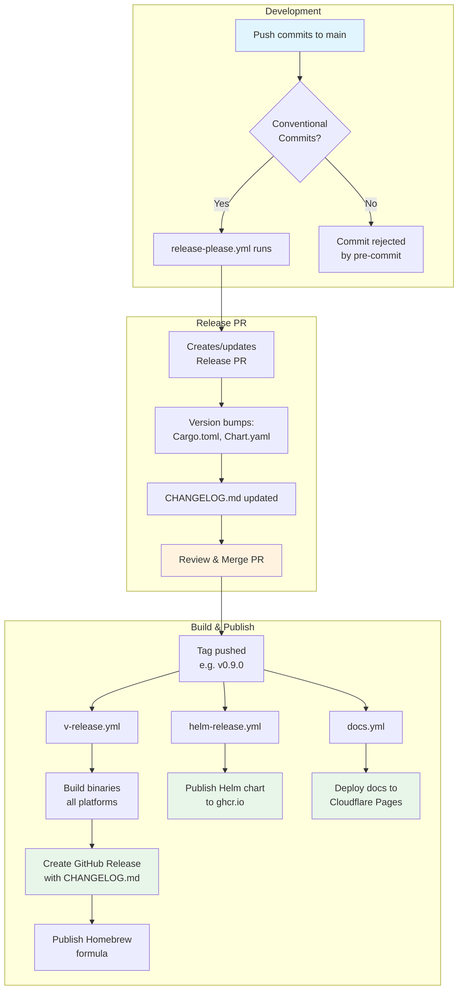

# Release Please Migration Design

**Date:** 2025-12-31
**Status:** Approved

## Summary

Migrate from release-plz to Google's release-please for release automation. release-plz failed because it doesn't support `version_files` (a cargo-release feature).

## Design Decisions

| Decision | Choice | Rationale |
|----------|--------|-----------|
| Release flow | Release PR | Allows review before release |
| Tag format | `v0.8.1` | Simple, no component prefix |
| Chart.yaml sync | extra-files | Automatic via jsonpath |
| Changelog | release-please owns | Single source of truth |
| GitHub Release | cargo-dist creates | Uses CHANGELOG.md content |
| Authentication | GitHub App | Can trigger downstream workflows |

## Architecture



## Files to Create

### release-please-config.json

```json
{
  "$schema": "https://raw.githubusercontent.com/googleapis/release-please/main/schemas/config.json",
  "release-type": "rust",
  "include-component-in-tag": false,
  "include-v-in-tag": true,
  "bump-minor-pre-major": true,
  "bump-patch-for-minor-pre-major": true,
  "skip-github-release": true,
  "changelog-sections": [
    {"type": "feat", "section": "Features"},
    {"type": "fix", "section": "Bug Fixes"},
    {"type": "perf", "section": "Performance Improvements"},
    {"type": "refactor", "section": "Code Refactoring"},
    {"type": "docs", "section": "Documentation"},
    {"type": "test", "section": "Tests"},
    {"type": "build", "section": "Build System"},
    {"type": "ci", "section": "CI/CD"},
    {"type": "chore", "section": "Miscellaneous", "hidden": true}
  ],
  "extra-files": [
    {
      "type": "yaml",
      "path": "charts/router-hosts-operator/Chart.yaml",
      "jsonpath": "$.version"
    },
    {
      "type": "yaml",
      "path": "charts/router-hosts-operator/Chart.yaml",
      "jsonpath": "$.appVersion"
    }
  ],
  "packages": {
    ".": {
      "component": "router-hosts"
    }
  }
}
```

### .release-please-manifest.json

```json
{
  ".": "0.8.0"
}
```

### .github/workflows/release-please.yml

```yaml
name: Release Please

on:
  push:
    branches: [main]

permissions:
  contents: write
  pull-requests: write

jobs:
  release-please:
    runs-on: ubuntu-latest
    steps:
      - uses: actions/create-github-app-token@v1
        id: app-token
        with:
          app-id: ${{ secrets.RELEASE_PLEASE_APP_ID }}
          private-key: ${{ secrets.RELEASE_PLEASE_PRIVATE_KEY }}

      - uses: googleapis/release-please-action@v4
        id: release
        with:
          token: ${{ steps.app-token.outputs.token }}
```

## Files to Modify

### Cargo.toml

Add to `[workspace.metadata.dist]`:

```toml
changelog = false
github-release = "CHANGELOG.md"
```

### docs/contributing/releasing.md

Complete rewrite replacing release-plz references with release-please.

## Files Already Deleted

- `release-plz.toml`
- `.github/workflows/release-plz.yml`

## Required Secrets

| Secret | Purpose |
|--------|---------|
| `RELEASE_PLEASE_APP_ID` | GitHub App ID for authentication |
| `RELEASE_PLEASE_PRIVATE_KEY` | GitHub App private key |

## Implementation Steps

1. Create `release-please-config.json`
2. Create `.release-please-manifest.json`
3. Create `.github/workflows/release-please.yml`
4. Update `Cargo.toml` with dist changelog settings
5. Update `docs/contributing/releasing.md`
6. Commit and push
7. Verify workflow runs on push to main
